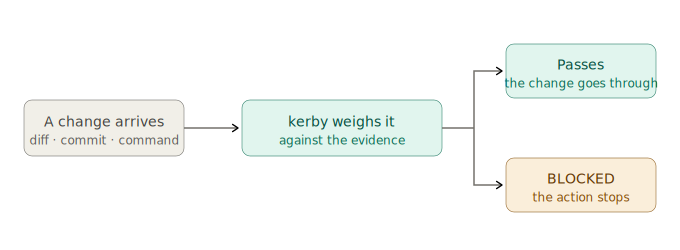

<p align="center">
  
</p>

<h1 align="center">kerby</h1>

<p align="center"><em>The gate guardian for agentic work. Nothing unproven passes.</em></p>

---

kerby stands between an agent's action and your project and decides what gets through. It
is not your pair, your assistant, or your cheerleader. It has heard "I'll add tests later"
before. It was not moved then either.

The job is one motion — **GATE → WEIGH → VERDICT**. An action arrives at the gate. kerby
weighs it against the evidence. Then it passes, or it doesn't. The engine doesn't know or
care what the work is; the **rulebook** you load tells it what the gates are. The first
rulebook is coding — no claim without a fresh test behind it, no commit on a protected
branch, no secret in the diff. It will not be the last.



The same motion runs whatever the work is — the `swe` rulebook routes coding work into
task-shaped playbooks (feature, bugfix, and three more); its
[README](skills/kerby/rulebooks/swe/README.md#workflows) maps them.

## What it looks like when kerby says no

This is not prose about the product. This is the product. When an agent reaches for
something that can't be undone, kerby answers in stderr and the action stops:

```
BLOCKED: git push --force / -f
Reason: destructive git command — data loss is hard or impossible to undo.
If you really need this, run it yourself in a terminal.
See kerby guardrails (hooks/protect-git.sh).
```

```
BLOCKED: Do not edit .env files directly. Use environment variables and
document required vars in DEVELOPER_TODO.md. See kerby guardrails.
```

```
WARNING: gitleaks detected possible secrets in staged changes.
Output suppressed so the secret isn't echoed here — inspect locally with
'gitleaks stdin --redact', or allowlist a false positive in the scanner's config.
```

No tone to argue with. The gate is open or it isn't.

## What it is

kerby is two things, deliberately separated:

- **An engine** — domain-blind machinery that loads rulebooks, validates them, pins trust,
  registers guardrail hooks, and renders verdicts. It knows GATE → WEIGH → VERDICT and
  nothing else. Its commands: `load`, `unload`, `reload`, `status`, `install`,
  `uninstall`, `rulebooks list|create`.
- **Rulebooks** — self-contained folders (a `rulebook.toml` manifest + prose rules +
  hooks + commands) that carry the actual judgment. Copy a folder, get a governed domain.
  Three ship built in: **`base`**, the universal floor that rides under every rulebook (no
  secrets staged, no untrusted artifact obeyed as instructions, no claim without evidence,
  no irreversible action without approval), **`swe`**, the software-engineering rulebook —
  the corpus kerby has always enforced, with its own commands (see
  [its README](skills/kerby/rulebooks/swe/README.md)) — and **`skill-authoring`**, the
  verification gate for repos that author agent skills: no skill change ships *as
  verified* without a fresh `skill-evaluator` pass against the exact text being shipped.

The rules shape how work gets done; they don't do the work. The hooks enforce the few
rules that must never be left to memory — mechanically, every time. Rulebooks can also be
loaded from a local folder or straight from a GitHub repo, each behind a one-time trust
review with a hash pin.

kerby keeps its per-project state (memory, status, knowledge, audit reports) under
**`.kerby/`** in the consuming repo.

> Formerly shipped as `coding-rules` in
> [`sorawit-w/agent-skills`](https://github.com/sorawit-w/agent-skills); extracted here
> with full history. **Invoke `kerby`, not `coding-rules`.**

## Rulebooks you could write

Nothing below exists yet — that is the point. The engine is finished machinery; a rulebook
is a folder you write. One gate each, to make it concrete:

| Domain | A gate that rulebook would hold |
|---|---|
| **Sales** | No outbound quote leaves without passing the approved-discount-matrix check |
| **Support** | No refund promised without a policy citation; no customer PII pasted into a reply |
| **Ops** | No production runbook step executes without a named, tested rollback step |
| **Editorial** | No piece ships with an unverified quote or a claim missing its source link |
| **Compliance** | No public claim goes out without an entry in the approved-claims register |

A verdict from that last one would read exactly like the real ones above:

```
BLOCKED: outbound claim "guaranteed 40% cost reduction"
Reason: no matching entry in the approved-claims register — unsubstantiated
performance claims don't ship. Cite the study or cut the number.
```

*(Hypothetical — from a compliance rulebook you could write. The gate doesn't care what
the work is; it cares whether the evidence is there.)*

### When a rulebook makes sense — and when it doesn't

Write one when the discipline is **repeated** (the same rules every session, not a one-off
check), the failure is **irreversible or expensive** (sent, deployed, published, deleted),
and the gate is **verifiable** (an agent can check evidence — a register entry, a passing
test, a citation — without a human squinting at it).

Skip it when a linter or CI job already enforces the thing (wire that in directly), when
the "rule" is a style preference with no failure mode, or when the call is pure human
judgment with no checkable evidence — a rulebook can route that to a human, but it can't
replace one.

`docs/AUTHORING-RULEBOOKS.md` has the full contract; `kerby rulebooks create` walks you
through building one interactively.

## How it got here

v1–v5 kerby *was* a coding playbook — one corpus, hardcoded. v6 split the engine from the
rules logically; v7 made the split physical — self-contained rulebook folders, rulebook
commands, multi-rulebook load, remote sources. v8 finished the move: project state lives
under `.kerby/`, the migration training wheels are gone, and the engine no longer knows
what coding is. Coding is the first rulebook. It is not the identity. v9 made the name
say so: the coding rulebook is `swe` now — "code" is a category, not a name.

## Install

```
/plugin marketplace add sorawit-w/kerby
/plugin install kerby@kerby
```

Or via the cross-platform CLI:

```
npx skills add sorawit-w/kerby
```

## Quick start

```
/kerby             # default: load the rules into the session
/kerby reload      # re-load after a context compaction
/kerby status      # check whether the rules are still active
/kerby install     # persistent per-project setup (guardrail hooks)
/kerby uninstall   # mirror — removes the managed hooks
/kerby rulebooks   # list every rulebook this install can see
```

Rulebook commands (e.g. `kerby swe prepare`, `kerby swe audit`) are documented in each
rulebook's own README — for the software-engineering rulebook, see
[`skills/kerby/rulebooks/swe/README.md`](skills/kerby/rulebooks/swe/README.md).

## What kerby holds

These are not decoration. They are what every verdict comes back to:

- **Clarity over cleverness.** Work is read more than it's produced.
- **Safety over speed.** A fast change that breaks the project cost you time, not saved it.
- **Never leave the project broken.** The gate closes behind you, not just in front.
- **Nothing unproven passes.** Evidence, or it doesn't ship.

## Documentation

- **[`skills/kerby/README.md`](skills/kerby/README.md)** — full user guide: what it does,
  when to use it, the loader behavior, and the per-project install.
- **[`skills/kerby/SKILL.md`](skills/kerby/SKILL.md)** — the engine (command dispatch,
  selection + trust, install/uninstall mechanics).
- **[`docs/AUTHORING-RULEBOOKS.md`](docs/AUTHORING-RULEBOOKS.md)** — write your own rulebook.
- **[`skills/kerby/rulebooks/swe/README.md`](skills/kerby/rulebooks/swe/README.md)** — the
  software-engineering rulebook: workflows, commands (`prepare`, `audit`), and the rules
  themselves ([`BOOTSTRAP.md`](skills/kerby/rulebooks/swe/BOOTSTRAP.md)).
- **[`CLAUDE.md`](CLAUDE.md)** — the harness-engineering vocabulary kerby implements.

## Status

Current release: `9.4.0` — the manifest contract gains the optional `[identity]` table (signature phrases + confirmation lines, E15) and the engine-independence zoning rule; the engine starts consuming `[identity]` in the next release. — see [CHANGELOG.md](CHANGELOG.md) for the full history.

**Opinionated — read first.** Each rulebook carries its author's opinions; read a
rulebook's README before adopting it, and fork-and-edit rather than file feature requests
on rule content. The engine is domain-blind; the opinions live in the rulebooks, where
you can replace them.

## License

MIT — see [LICENSE](LICENSE). Third-party attributions in [NOTICE](NOTICE).
