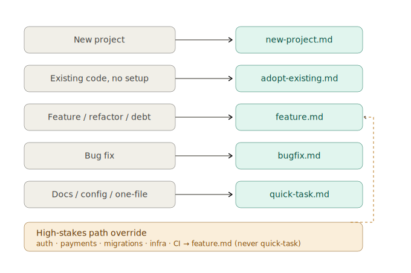

# swe — the software-engineering rulebook

kerby's first domain rulebook, auto-detected by an unpinned `kerby load` in a repo that
carries a build manifest (v9.1; no longer a silent default). Clarity over
cleverness, safety over speed, never leave the repo broken — and nothing unproven
passes the gate. Extends `base` (the universal floor rides along automatically).

*Named `code` through v8; renamed `swe` in v9.0.0 — "code" is a category, not a name.*

> ⚠️ **Read this before adopting.** This rulebook is **deliberately, aggressively
> opinionated.** It captures *one author's* personal taste, accumulated from years of
> breaking and fixing things while pairing with agents. It is **not** a "best-practice"
> guide or a neutral default. The choices are personal, sometimes contrarian, and load on
> every session that uses them — there is a real input-token cost. **Read
> [`BOOTSTRAP.md`](BOOTSTRAP.md) end-to-end before adopting. Fork, edit, or skip rules
> that don't fit your taste.** The rulebook provides a frame; your judgment is what makes
> it useful.

## Why this exists

Most "agent coding" advice is either too vague to land (*"be careful with git"*) or too
project-specific to travel (*"run `npm test && npm run lint`"*). What survives across
projects, stacks, and teammates is **methodology** — the *shape* of how an agent should
approach work.

This rulebook packages one person's methodology as a loadable session preamble:

- A **Prime Directive** — clarity over cleverness, safety over speed, never leave the repo broken.
- **Hard rules** that apply on every task — branching, commit discipline, verification, resource cleanup, manual-verification instructions, sub-agent delegation, ambiguity-before-cost.
- **Routed workflows** — the agent reads the right workflow file (`new-project`, `adopt-existing`, `feature`, `bugfix`, `quick-task`) instead of guessing from memory.
- **A reference index** for the long tail of decisions — debugging, error handling, vendor adapters, knowledge-base maintenance, design tokens, multi-tool support across Claude Code / Codex / Cursor.
- **A meta-rule** about adding rules — every proposed new rule passes a cost gate (line count, frequency, severity, coverage, testability) before it earns its place.

If your taste matches, the rulebook will feel like an extension of how you already think.
If it doesn't, please **fork and adapt** rather than installing as-is.

## Workflows

The rulebook routes every task to one of **five task-shape playbooks** under
[`workflows/`](workflows/) — the agent reads the matching file instead of improvising
from memory. The files are the single source of truth; the table below names and links
them. (The engine mandates none of this — a different rulebook brings its own routing,
or none.)

| Task | Workflow | What it does |
|---|---|---|
| New project (no code) | [`new-project.md`](workflows/new-project.md) | Greenfield setup from requirements — branch, scaffold, fill `agent-context.yaml`, `ROADMAP.md`, verify. |
| Existing code, no kerby artifacts yet | [`adopt-existing.md`](workflows/adopt-existing.md) | Onboard an existing repo (the `prepare` command) — derive context artifacts from code + git history, tiered by inferability, diff-and-confirm on every write. |
| Feature / enhancement / refactor / tech debt | [`feature.md`](workflows/feature.md) | Plan, then the task loop (do → check → commit gate → log → repeat), then validate + finish. |
| Bug fix | [`bugfix.md`](workflows/bugfix.md) | Reproduce → diagnose root cause (≤3 hypotheses) → failing test + minimal fix → commit gate → finish. |
| Docs / config / single-file edit (complexity 1–3) | [`quick-task.md`](workflows/quick-task.md) | Fit-check, in-place branch, do → check → commit. Escalates to `feature` if it outgrows the bounds. |
| ⚠️ **High-stakes** — auth · payments · migrations · infra · CI · prod-traffic values | always [`feature.md`](workflows/feature.md) | Override: blast radius isn't bounded by LOC, so these route to `feature` even for one-line edits — **never `quick-task`**. |

### Where kerby sits in the loop

kerby is a **governor, not an actor** — it shapes how each step is done (rules) and
hard-blocks a few irreversible actions (hooks); it never writes the test or implements
the change. The diagrams below show *where it sits* inside the agent's own loop, keyed
to task type.

**Feature loop** — `Plan → Do → Check → Commit gate → Log → repeat → Validate + finish`. Test-first is a preference *inside* `Do`, not a leading phase; the commit gate runs the full `build · lint · test` on **every** iteration, not once at the end.

**Bugfix loop** — same commit gate and failure branch, different front half: `Reproduce → Diagnose (root cause) → Fix (failing test → minimal fix) → commit gate → finish`. It does **not** start by writing tests; the failing test comes after diagnosis, inside `Fix`.

In both loops the legend is the same — **agent acts** (gray) / **kerby rule** (teal) / **kerby gate / hook** (amber):

- A **rule** shapes every step (how to plan, how to check, what "done" means).
- **Hooks hard-block wherever the agent reaches for something irreversible** — not only at commit: `.env` edits (`protect-env`, during `Do`), destructive git (`protect-git`), secrets in staged files (`pre-commit-check`, at the commit gate).
- **Failure branch:** a failing gate spends a per-error-type retry budget (build 5 / test 3 / lint 5 / deps 5), then "cheapen the loop before grinding"; if the budget is exhausted → **revert and mark `BLOCKED` in `.kerby/BLOCKERS.md`**. The iron rule is *never leave the repo broken.*

## Commands

Declared in the manifest, dispatched by the engine (`kerby swe <command>`; the bare form
also works while only one loaded rulebook provides the command — inference):

| Command | What it does |
|---|---|
| `kerby swe prepare` | Onboard an **existing repo**: populate (and refresh) the artifacts BOOTSTRAP reads at session start — `agent-context.yaml`, `CONTEXT.md`, `.kerby/knowledge/`, `.kerby/STATUS.md`, `.kerby/memory.log` — from your real code and git history. Tiered by inferability; **diff-and-confirm on every write**; refresh never clobbers human-curated content. The existing-code counterpart to greenfield `new-project` setup. The `.kerby/knowledge/` candidate pass auto-runs on first onboarding and is opt-in once entries exist — force it with `kerby swe prepare:knowledge` (or "force the knowledge pass"). |
| `kerby swe audit` | **Read-only** static conformance audit of a real-coding project against the *current* rule corpus → self-contained HTML report under `.kerby/audits/` (git-excluded). `audit [--full] [<dimension> ...]` — incremental by default, dimensions `security`/`quality`/`data`/`git-hygiene`/`docs`; `--sast` adds the pinned deterministic scan layer. Derived + classifier-anchored: only checks rules that leave durable artifacts, names what it can't statically see in a coverage banner. Never edits/commits/merges. NOT a bug review (`/code-review`) or a SKILL.md audit (`skill-evaluator`); redirects to the latter on a skill repo. |

Both are idempotent — `prepare` re-derives only agent-owned content and is a diffs-only
near-no-op on an already-onboarded repo; `audit` writes a timestamped report and never
mutates the repo.

## Layout

| Path | What it is |
|---|---|
| `rulebook.toml` | the manifest — the single authority for what this rulebook contains |
| `BOOTSTRAP.md` | the root body: prime directive, decision ladder, routing, hard rules, reference index |
| `references/` | the long-tail topic guides BOOTSTRAP's index loads on demand |
| `workflows/` | the five task-shape playbooks (new-project, adopt-existing, feature, bugfix, quick-task) |
| `hooks/` | tool-boundary enforcers (destructive-git, `.env` protection, high-stakes routing, …) + tests |
| `commands/` | the bodies of this rulebook's user-invocable commands |
| `templates/`, `scripts/`, `assets/` | agent-context schema/template + validator, audit/html templates, workflow diagrams |

Self-contained: everything this rulebook *declares* lives in this folder. Copy the
folder, get the rules — the receiving kerby will still ask its user for approval
before loading it, exactly as it should. The one host dependency is the floor:
`swe` extends `base`, so its `hollow-test-heuristic` enforcer reuses the floor's
`pre-commit-check.sh` rather than shipping a private copy of the non-disablable
secret scan. The floor always rides along from the host install — `kerby install`
binds that check to the host `base` script, and if a relocated copy can't reach a
floor, the soft check degrades to behavioral (the secret-scan floor itself is
never affected — `base` registers it directly).

## Checks

Eleven checks: five hook-backed (`destructive-git` — floor, `protected-branch-commit`,
`protect-env`, `env-read-warning`, `high-stakes-routing`, `hollow-test-heuristic`) and
five prose gates (`operating-rules` = BOOTSTRAP, `quality-gate-tiers`,
`verification-before-completion`, `security-lens`, `guardrails-scope-security`).
Declared enforcement is honest: `kerby status` shows what is mechanically bound
versus behavioral, per check.

## A note on opinionation

The rules in `BOOTSTRAP.md` reflect specific choices that may not match your judgment:

- **Worktree-default for feature work** (with a 3-question gate to skip when overhead isn't justified). If your repo is npm-heavy or tiny, you may want `git checkout -b` everywhere.
- **Commit after every completed piece of work**, not at the end of the session. Some teams prefer squashed commits and a clean history; this rule fights that.
- **No completion claims without fresh evidence.** Some workflows are exploratory and "should work" is fine. Not here.
- **Manual verification instructions in every completion report.** Reasonable for shipped features; overkill for one-line typo fixes.
- **`DESIGN.md` as design-token authority** when present. Opinionated wiring into the [Google Labs spec](https://github.com/google-labs-code/design.md), alpha.
- **Methodology over scripts.** Hardcoded commands (`npm test`) lose to project-detected commands (`{test_command}`).

These choices have stated reasons in the rule files. Read the reasons; keep the ones
that match your work; **delete or rewrite the ones that don't.** The engine loads
whatever is in this folder's `BOOTSTRAP.md` — the easiest way to make it yours is to
fork the repo and edit BOOTSTRAP directly.

## Editing the rules

[`../../CLAUDE.md`](../../CLAUDE.md) (the skill-root authoring guide, not a project's
`CLAUDE.md`) governs **rule edits** — change-class table, rule-cost gate, authoring
style notes. If you fork to adapt the rules, read it before adding rules; many proposed
rules don't pay back their token cost.

For rule **evaluation** (does this rule actually change agent behavior?), use the
[`skill-evaluator`](https://github.com/sorawit-w/agent-skills/tree/main/skills/skill-evaluator)
skill — split-context audit removes author bias.

## Provenance

The original kerby corpus (v1–v5 as a monolithic playbook), split engine-from-rules
in v6.0.0, physically self-contained in v7.0.0, renamed `code` → `swe` in v9.0.0.
Contract: `docs/rulebook-contract.md`.
